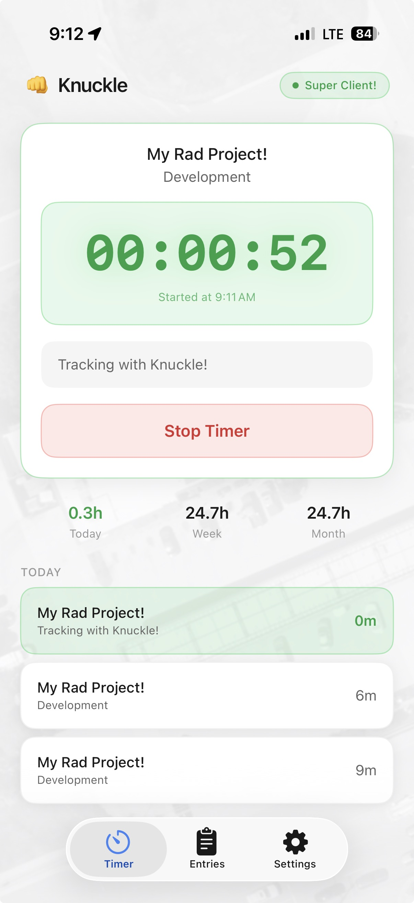
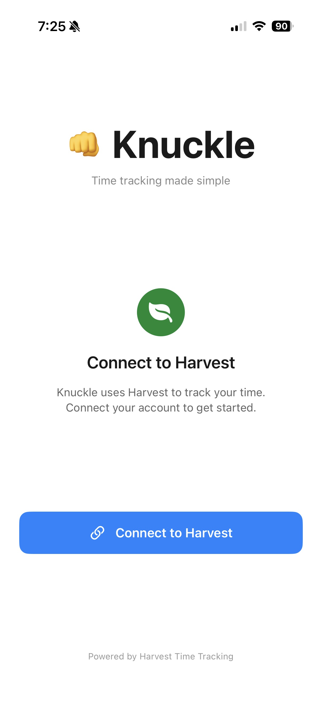
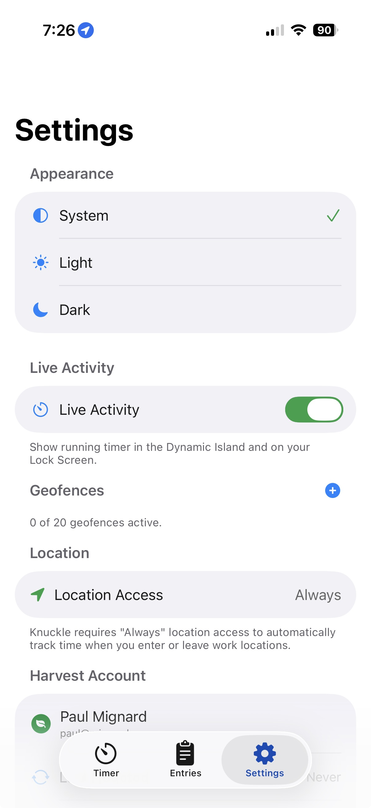
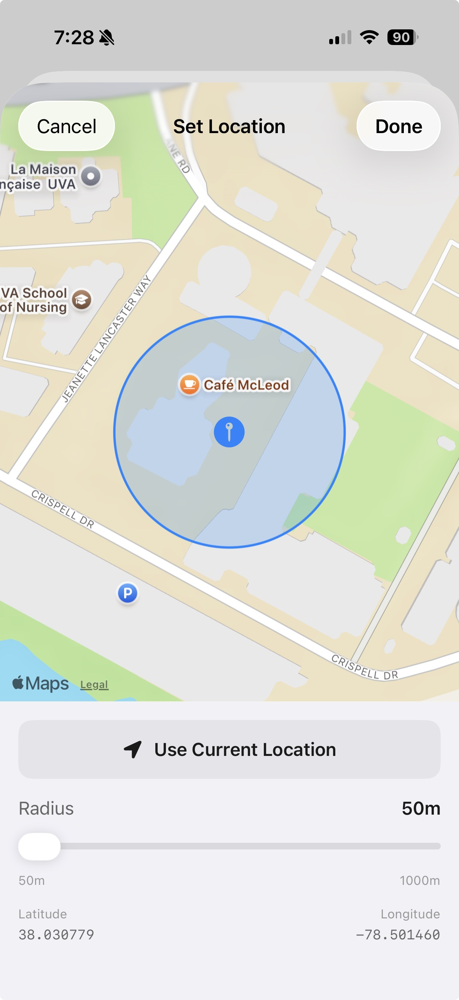
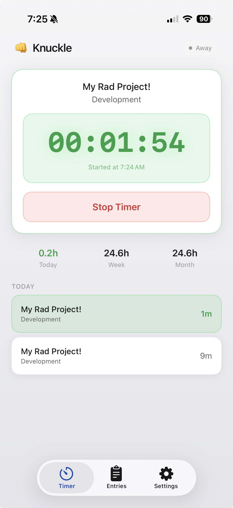

# 👊 Knuckle

### Your Harvest timer starts when you arrive at work.

Set a geofence around your office, job site, or client location. 
Walk in, your Harvest timer starts. Walk out, it stops. That's it.

<picture>
  <source media="(prefers-color-scheme: dark)" srcset="docs/images/dark-hero.jpg">
  
</picture>

*Requires iOS 17+ and an active Harvest account.*

## Why this exists

Harvest is great but I work onsite and I just kept forgetting to start my timer. Same place, over and over again — you'd think I'd remember but I don't. Not tracking time properly means I need to estimate at the end of the day, and we all know improper time recording either takes money out of your pocket or your client's pocket. Neither is good.

I created Knuckle to solve this by automatically starting and stopping my Harvest timer based on my location. Now my time is tracked automatically and I don't have to remember to start or stop it. I can use that brain space to remember other things like quotes from *Say Anything* or other random 90's minutiae. Win-win, am I right?

## How it works

| 1. Connect Harvest | 2. Set permissions | 3. Create a geofence | 4. Start tracking | 5. Manual if needed |
|:---:|:---:|:---:|:---:|:---:|
| <picture><source media="(prefers-color-scheme: dark)" srcset="docs/images/dark-step1-login.jpg"></picture> | <picture><source media="(prefers-color-scheme: dark)" srcset="docs/images/dark-step2-permissions.jpg"></picture> | <picture><source media="(prefers-color-scheme: dark)" srcset="docs/images/dark-step3-create.jpg"></picture> | <picture><source media="(prefers-color-scheme: dark)" srcset="docs/images/dark-step4-geotrack.jpg"></picture> | <picture><source media="(prefers-color-scheme: dark)" srcset="docs/images/dark-step5-manual-track.jpg"></picture> |
| Sign in with your Harvest account. OAuth only — your password is never seen. | Allow location access so Knuckle can detect when you arrive and leave. | Drop a pin on your workplace and set a radius. Link it to a Harvest project. | Walk into your geofence and your timer starts automatically. Walk out, it stops. | Need to track time outside a geofence? Start and stop timers manually anytime. |

## What's in this repo

| Directory | What it is |
|---|---|
| `Knuckle.iOS/` | The iOS app (SwiftUI + CoreLocation region monitoring, Live Activities, home screen widget) |
| `Knuckle.Auth/` | Minimal OAuth proxy (ASP.NET Core) that handles the Harvest token exchange so the `client_secret` never ships in the app |

## Self-hosting the auth proxy

The iOS app talks to a small OAuth proxy for the Harvest token exchange. To run your own:

1. Create an OAuth2 application at [Harvest ID](https://id.getharvest.com/developers).
2. Deploy `Knuckle.Auth` (see its README) with `Harvest__ClientId` / `Harvest__ClientSecret` set via environment variables.
3. Point the iOS app at your proxy (`HarvestAPIClient.authProxyBaseURL`) and set your `clientId` in `HarvestAuthService`.

## Building the iOS app

Open `Knuckle.iOS/Punch/Punch/Knuckle.xcodeproj`, set your own development team in Signing & Capabilities, and run. The app needs **Always** location permission with **Precise Location** for background geofencing.

## Questions

**Why is this called Knuckle?**
When I first started building this I actually called it Punch until I realized that nearly everyone else that worked on a time tracking product called it Punch. I switched to Knuckle because I already had fist emojis all over the project.

**Does this drain my battery?**
No. Knuckle uses iOS's native geofencing APIs, which are incredibly efficient. Apple handles the monitoring — there's no constant GPS tracking. The system just wakes the app up when you cross a boundary.

**How accurate is the geofencing?**
iOS geofencing typically triggers within 100–200 meters of your boundary. Set your radius a bit larger than your actual location to account for GPS drift. Works best outdoors.

**What about my existing Harvest data?**
Knuckle just starts and stops timers. All your time entries, projects, and reports stay in Harvest exactly as you'd expect. None of your time data is stored.

**Can I still use manual timers?**
Absolutely. Knuckle doesn't interfere with anything. Start timers from the Harvest app, website, or Knuckle — it all works together.

**Is there an Android version?**
Not yet. iOS only for now because Android's geofencing APIs are less reliable for background tracking. Maybe someday.

**Are you tracking my location?**
No. Knuckle doesn't track or store your location. It uses iOS's geofencing system, which means Apple monitors whether you've crossed a boundary — the app just gets a "yes" or "no" ping. Your GPS coordinates are never seen.

**Are you sending my location to Harvest? Or anywhere?**
Absolutely not. Your location never leaves your device. When you cross a geofence, Knuckle sends a "start timer" or "stop timer" command to Harvest — that's it. No coordinates, no location history, nothing.

## License

[MIT](LICENSE)
